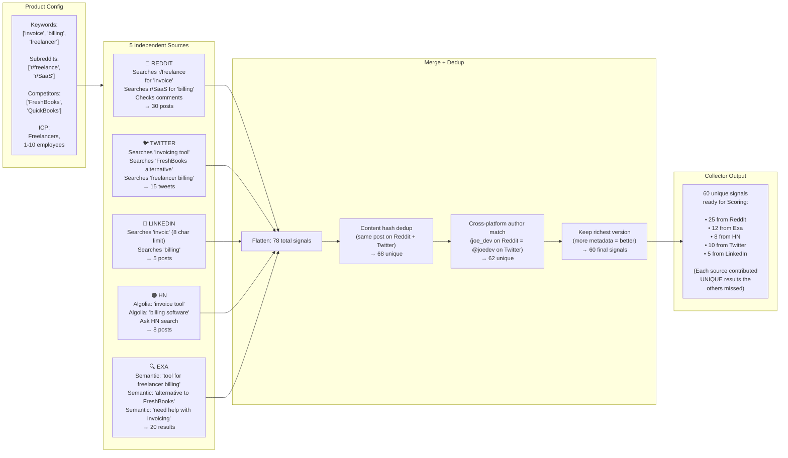
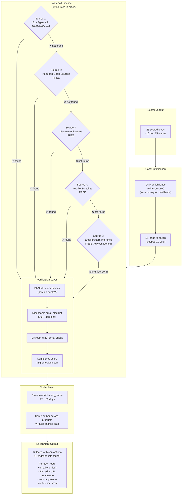

# Czero — Architecture Diagrams & File Structure

---

## 1. Complete App Flow (Mermaid)

```mermaid
flowchart TB
    subgraph USER["👤 USER"]
        A["Paste SaaS URL"]
    end

    subgraph PHASE0["🧠 PHASE 0: PRODUCT ANALYSIS"]
        B["Fetch website content\n(TinyFish Fetch — free)"]
        C["LLM extracts:\nICP, keywords, pain points,\ncompetitors, subreddits"]
        D["Store in products table"]
    end

    subgraph COLLECTOR["📡 ENGINE 1: COLLECTOR\n(Parallel Independent Sources)"]
        direction TB
        E1["🔴 Reddit\n(PRAW keyword search\n+ comment monitoring)"]
        E2["🐦 Twitter/X\n(Scweet GraphQL API\n+ competitor complaints)"]
        E3["🔗 LinkedIn\n(No-cookies scraper\n+ professional context)"]
        E4["🟠 Hacker News\n(Algolia search\nAsk HN + Show HN)"]
        E5["🔍 Exa Semantic\n(Entire web search\nfinds different phrasing)"]
        
        E1 --> MERGE
        E2 --> MERGE
        E3 --> MERGE
        E4 --> MERGE
        E5 --> MERGE
        
        MERGE["🔄 MERGE\nFlatten all results"]
        DEDUP["🧹 DEDUP\nContent hash +\ncross-platform\nauthor matching"]
        
        MERGE --> DEDUP
    end

    subgraph SCORER["🎯 ENGINE 2: SCORER\n(5-Layer Pipeline)"]
        direction TB
        F1["Layer 1:\nKeyword Pre-Filter\n(free, removes 90% noise)"]
        F2["Layer 2:\nLLM Intent Scoring\n0-100\n($0.002/post)"]
        F3["Layer 3:\nICP Match Scoring\nHeuristic + LLM blend"]
        F4["Layer 4:\nTemporal Scoring\nFreshness +\nMulti-source boost"]
        F5["Layer 5:\nSpike Detection\nBombora-style trends"]
        F6["📊 Final Score\nWeighted combination\n+ Category\n(hot/warm/cold)"]
        F7["💬 Explain Why\nHuman-readable\nbullet points"]
        
        F1 --> F2
        F2 --> F3
        F3 --> F4
        F4 --> F5
        F5 --> F6
        F6 --> F7
    end

    subgraph ENRICHER["📊 ENGINE 3: ENRICHER\n(Waterfall Pipeline)"]
        direction TB
        G1["Source 1:\nExa Agent API\n($0.01-0.05/lead)"]
        G2["Source 2:\nKeeLead Open Sources\n(free, 35 sources)"]
        G3["Source 3:\nUsername Patterns\n(free, heuristic)"]
        G4["Source 4:\nProfile Scraping\n(free, last resort)"]
        G5["Source 5:\nEmail Pattern Inference\n(free, low confidence)"]
        G6["✅ Verify\nDNS MX check\nDisposable blocklist"]
        G7["💾 Cache\n30-day TTL\nReuse across products"]
        
        G1 -->|"not found"| G2
        G2 -->|"not found"| G3
        G3 -->|"not found"| G4
        G4 -->|"not found"| G5
        G1 -->|"found"| G6
        G2 -->|"found"| G6
        G3 -->|"found"| G6
        G4 -->|"found"| G6
        G5 -->|"found"| G6
        G6 --> G7
    end

    subgraph DRAFTER["✍️ OUTREACH GENERATION"]
        H1["Email Draft\n(3 sentences, personalized)"]
        H2["LinkedIn DM Draft\n(2 sentences, friendly)"]
        H3["Reddit Reply Draft\n(helpful, not spammy)"]
    end

    subgraph DELIVERY["📬 DELIVERY"]
        I1["📧 Weekly Email Digest\n(Resend — free tier)"]
        I2["📊 Dashboard\n3 screens only:\nSettings → Leads → Detail"]
    end

    subgraph FEEDBACK["🔄 LEARNING LOOP"]
        J1["👍👎 on every lead"]
        J2["Feedback trains\nscoring weights"]
        J3["Results improve\nover time"]
        
        J1 --> J2
        J2 --> J3
        J3 -->|"calibrated weights"| F6
    end

    A --> B
    B --> C
    C --> D
    D -->|"product config"| COLLECTOR
    
    DEDUP -->|"~60 unique signals"| F1
    F7 -->|"scored leads"| G1
    G7 -->|"enriched leads"| H1
    G7 --> H2
    G7 --> H3
    H1 --> I1
    H2 --> I2
    H3 --> I2
    I2 --> J1

    style USER fill:#1a1a2e,stroke:#e94560,color:#fff
    style PHASE0 fill:#1a1a2e,stroke:#0f3460,color:#fff
    style COLLECTOR fill:#1a1a2e,stroke:#533483,color:#fff
    style SCORER fill:#1a1a2e,stroke:#ff6b35,color:#fff
    style ENRICHER fill:#1a1a2e,stroke:#f7c948,color:#fff
    style DRAFTER fill:#1a1a2e,stroke:#48bb78,color:#fff
    style DELIVERY fill:#1a1a2e,stroke:#ed8936,color:#fff
    style FEEDBACK fill:#1a1a2e,stroke:#9f7aea,color:#fff
```



---

## 2. Data Flow Timeline (What Happens When)

```mermaid
gantt
    title Czero Data Flow Timeline
    dateFormat X
    axisFormat %s

    section Phase 0
    User pastes URL           :a1, 0, 5
    Fetch + Analyze website   :a2, 5, 15
    Store product config      :a3, 15, 16

    section Collector (Parallel)
    Reddit keyword search     :b1, 16, 26
    Twitter keyword search    :b2, 16, 28
    LinkedIn no-cookies       :b3, 16, 30
    HN Algolia search         :b4, 16, 22
    Exa semantic search       :b5, 16, 24
    Merge + Dedup             :b6, 30, 32

    section Scorer
    Keyword pre-filter        :c1, 32, 33
    LLM intent scoring       :c2, 33, 38
    ICP match scoring        :c3, 38, 40
    Temporal + multi-source   :c4, 40, 41
    Spike detection           :c5, 41, 42
    Final score + explain     :c6, 42, 43

    section Enricher
    Waterfall enrichment      :d1, 43, 50
    Verification              :d2, 50, 52
    Cache store               :d3, 52, 53

    section Delivery
    Generate outreach drafts  :e1, 53, 55
    Send email digest         :e2, 55, 56
```



---

## 3. Collector Engine — Parallel Flow Detail



---

## 4. Scorer Engine — 5-Layer Pipeline Detail

```mermaid
flowchart TB
    subgraph INPUT["Collector Output"]
        I["60 unique signals"]
    end

    subgraph L1["Layer 1: Keyword Pre-Filter\n(FREE — instant)"]
        direction TB
        L1A["Check: Does text contain\nany product keywords?"]
        L1B["Check: Does text have\nintent phrases?\n('looking for', 'need', 'recommend')"]
        L1C["Result:\n45 signals pass\n15 filtered out"]
        L1A --> L1B --> L1C
    end

    subgraph L2["Layer 2: LLM Intent Scoring\n($0.002/post — batch of 5)"]
        direction TB
        L2A["Batch 5 posts per\nLLM call (10x cheaper)"]
        L2B["Score intent 0-100\nScore urgency 0-100\nGenerate reasoning"]
        L2C["Result:\nIntent scores for all 45"]
        L2A --> L2B --> L2C
    end

    subgraph L3["Layer 3: ICP Match Scoring\n(FREE heuristic + $0.001 LLM)"]
        direction TB
        L3A["Quick heuristic:\nauthor title, company,\nsubreddit match"]
        L3B["If score 20-80:\nLLM for nuanced scoring"]
        L3C["Result:\nICP match for all 45"]
        L3A --> L3B --> L3C
    end

    subgraph L4["Layer 4: Temporal + Multi-Source\n(FREE — instant)"]
        direction TB
        L4A["Recency: post < 24h = 100\npost 3d = 70, post 7d = 40"]
        L4B["Engagement: upvotes, comments"]
        L4C["Multi-source: same author\non Reddit + Twitter = bonus"]
        L4A --> L4B --> L4C
    end

    subgraph L5["Layer 5: Spike Detection\n(FREE — Bombora-style)"]
        direction TB
        L5A["Count signals this week"]
        L5B["Count signals last week\n(baseline)"]
        L5C["If current > baseline × 2:\nSPIKE DETECTED"]
        L5A --> L5B --> L5C
    end

    subgraph FINAL["Final Score Calculation"]
        direction TB
        F1["Weighted sum:\nIntent × 0.35\nICP × 0.25\nRecency × 0.15\nEngagement × 0.08\nMulti-source × 0.10\nSpike × 0.07"]
        F2["Category:\n≥ 75 = 🔥 HOT\n50-74 = 🟡 WARM\n< 50 = ❄️ COLD"]
        F3["Explain Why:\n✓ Directly asking for your product\n✓ Freelancer — matches your ICP\n✓ Posted 4 hours ago — fresh"]
        F1 --> F2 --> F3
    end

    I --> L1
    L1 --> L2
    L2 --> L3
    L3 --> L4
    L4 --> L5
    L5 --> FINAL
```



---

## 5. Enricher Engine — Waterfall Pipeline Detail



---

## 6. Complete User Journey Flow


---

## 7. File Structure

```
czero/
├── PLAN.md                          # Project plan
├── ROADMAP.md                       # Chunked tasks for delegation
├── ENGINES.md                       # Deep technical spec for 3 engines
├── ARCHITECTURE.md                  # This file (diagrams + file tree)
│
├── frontend/                        # Next.js 15 frontend
│   ├── app/
│   │   ├── page.tsx                 # Landing page
│   │   ├── layout.tsx               # Root layout (dark theme)
│   │   │
│   │   ├── auth/
│   │   │   ├── login/page.tsx       # Login page
│   │   │   ├── signup/page.tsx      # Signup page
│   │   │   └── callback/page.tsx    # OAuth callback
│   │   │
│   │   ├── dashboard/
│   │   │   ├── layout.tsx           # Dashboard layout (sidebar)
│   │   │   ├── page.tsx             # Leads list (main screen)
│   │   │   ├── settings/
│   │   │   │   └── page.tsx         # Product setup page
│   │   │   ├── leads/
│   │   │   │   └── [leadId]/
│   │   │   │       └── page.tsx     # Lead detail page
│   │   │   └── billing/
│   │   │       └── page.tsx         # Billing/subscription page
│   │   │
│   │   └── api/                     # API proxy routes (optional)
│   │
│   ├── components/
│   │   ├── ui/                      # shadcn/ui components
│   │   ├── LeadCard.tsx             # Lead card component
│   │   ├── ScoreBadge.tsx           # 🔥🟡❄️ score badge
│   │   ├── ExplainWhy.tsx           # "Why this lead" panel
│   │   ├── DraftViewer.tsx          # Email/LinkedIn/Reddit draft tabs
│   │   ├── ProductAnalyzer.tsx      # URL input + analysis display
│   │   └── KeywordManager.tsx       # Tag list for keywords
│   │
│   ├── lib/
│   │   ├── supabase.ts              # Supabase client
│   │   ├── api.ts                   # Backend API client
│   │   └── utils.ts                 # Helper functions
│   │
│   ├── middleware.ts                # Auth protection
│   ├── .env.local                   # Environment variables
│   ├── package.json
│   ├── tailwind.config.ts
│   └── next.config.js
│
├── api/                             # Python FastAPI backend
│   ├── app/
│   │   ├── __init__.py
│   │   ├── main.py                  # FastAPI app entry point
│   │   ├── config.py                # Pydantic Settings (env vars)
│   │   │
│   │   ├── models/                  # Pydantic models
│   │   │   ├── __init__.py
│   │   │   ├── product.py           # Product model
│   │   │   ├── signal.py            # Signal model (raw post)
│   │   │   ├── lead.py              # Lead model (scored + enriched)
│   │   │   └── user.py              # User model
│   │   │
│   │   ├── routes/                  # API endpoints
│   │   │   ├── __init__.py
│   │   │   ├── products.py          # CRUD for products
│   │   │   ├── leads.py             # GET leads, feedback
│   │   │   ├── billing.py           # Stripe integration
│   │   │   └── health.py            # Health check
│   │   │
│   │   ├── engines/                 # ⭐ THE 3 CORE ENGINES
│   │   │   ├── __init__.py
│   │   │   │
│   │   │   ├── collector/           # 📡 ENGINE 1: Signal Collection
│   │   │   │   ├── __init__.py
│   │   │   │   ├── orchestrator.py  # Master orchestrator (parallel dispatch)
│   │   │   │   ├── merger.py        # Merge + dedup across sources
│   │   │   │   ├── sources/         # ⭐ Each source is independent
│   │   │   │   │   ├── __init__.py
│   │   │   │   │   ├── base.py      # BaseSourceManager (abstract class)
│   │   │   │   │   ├── reddit.py    # Reddit PRAW + RSS + JSON fallback
│   │   │   │   │   ├── twitter.py   # Twitter/X Scweet
│   │   │   │   │   ├── linkedin.py  # LinkedIn no-cookies scraper
│   │   │   │   │   ├── hn.py        # Hacker News Algolia
│   │   │   │   │   └── exa.py       # Exa semantic search
│   │   │   │   └── resilience/      # Resilience layer
│   │   │   │       ├── __init__.py
│   │   │   │       ├── circuit_breaker.py
│   │   │   │       └── rate_limiter.py
│   │   │   │
│   │   │   ├── scorer/              # 🎯 ENGINE 2: Intent Scoring
│   │   │   │   ├── __init__.py
│   │   │   │   ├── orchestrator.py  # Master orchestrator (5-layer pipeline)
│   │   │   │   ├── layers/          # ⭐ Each layer is independent
│   │   │   │   │   ├── __init__.py
│   │   │   │   │   ├── pre_filter.py      # Layer 1: Keyword pre-filter
│   │   │   │   │   ├── intent_scorer.py   # Layer 2: LLM intent scoring
│   │   │   │   │   ├── icp_scorer.py      # Layer 3: ICP match scoring
│   │   │   │   │   ├── temporal_scorer.py # Layer 4: Recency + engagement
│   │   │   │   │   ├── spike_detector.py  # Layer 5: Demand spike detection
│   │   │   │   │   └── final_calculator.py # Weighted score + category
│   │   │   │   ├── explainer.py     # "Explain Why" generator
│   │   │   │   └── calibration.py   # Self-learning weight adjustment
│   │   │   │
│   │   │   └── enricher/            # 📊 ENGINE 3: Contact Enrichment
│   │   │       ├── __init__.py
│   │   │       ├── orchestrator.py  # Master orchestrator (waterfall)
│   │   │       ├── waterfall.py     # Waterfall pipeline logic
│   │   │       ├── sources/         # ⭐ Each enrichment source
│   │   │       │   ├── __init__.py
│   │   │       │   ├── base.py      # BaseEnricher (abstract class)
│   │   │       │   ├── exa_agent.py # Exa Agent API
│   │   │       │   ├── keelead.py   # KeeLead open sources
│   │   │       │   ├── username_pattern.py  # Username heuristic
│   │   │       │   ├── profile_scraper.py   # Profile page scraping
│   │   │       │   └── email_pattern.py     # Email pattern inference
│   │   │       ├── verifier.py      # DNS MX + disposable check
│   │   │       └── cache.py         # Enrichment cache (30-day TTL)
│   │   │
│   │   ├── services/                # Shared services
│   │   │   ├── __init__.py
│   │   │   ├── analyzer.py          # URL → product analysis
│   │   │   ├── drafter.py           # Outreach draft generation
│   │   │   └── emailer.py           # Email digest sender
│   │   │
│   │   └── workers/                 # Celery background tasks
│   │       ├── __init__.py
│   │       ├── celery_app.py        # Celery configuration
│   │       ├── collect_signals.py   # Task: run collector
│   │       ├── score_leads.py       # Task: run scorer
│   │       ├── enrich_leads.py      # Task: run enricher
│   │       └── generate_digests.py  # Task: send weekly emails
│   │
│   ├── tests/
│   │   ├── __init__.py
│   │   ├── test_analyzer.py
│   │   ├── test_collector.py        # Test each source independently
│   │   ├── test_scorer.py           # Test each layer independently
│   │   ├── test_enricher.py         # Test each source independently
│   │   ├── test_integration.py      # End-to-end tests
│   │   └── conftest.py              # Shared fixtures
│   │
│   ├── Dockerfile
│   ├── requirements.txt
│   ├── pyproject.toml
│   └── .env
│
├── .github/
│   └── workflows/
│       └── ci.yml                   # CI pipeline
│
├── .gitignore
└── README.md
```

---

## 8. Why This File Structure

### Engine = Module
```
engines/
├── collector/       # Engine 1 — everything about collecting signals
├── scorer/          # Engine 2 — everything about scoring leads
└── enricher/        # Engine 3 — everything about finding contacts
```

**Each engine is a self-contained module.** You can develop, test, and deploy each independently.

### Source = Separate File
```
engines/collector/sources/
├── base.py          # Abstract base class (shared interface)
├── reddit.py        # Reddit PRAW implementation
├── twitter.py       # Twitter Scweet implementation
├── linkedin.py      # LinkedIn scraper implementation
├── hn.py            # Hacker News Algolia implementation
└── exa.py           # Exa semantic search implementation
```

**Each source is a separate file.** Easy to:
- Add a new source (just add `youtube.py`)
- Fix a broken source (edit one file, not the whole engine)
- Test a source in isolation
- Remove a source without affecting others

### Layer = Separate File
```
engines/scorer/layers/
├── pre_filter.py      # Layer 1
├── intent_scorer.py   # Layer 2
├── icp_scorer.py      # Layer 3
├── temporal_scorer.py # Layer 4
├── spike_detector.py  # Layer 5
└── final_calculator.py # Final score
```

**Each scoring layer is a separate file.** Easy to:
- Tune one layer without touching others
- A/B test different scoring approaches
- Add new layers (e.g., "competitor mention detector")

### Orchestration Pattern

```
engines/collector/orchestrator.py
  └── imports ALL sources from sources/
  └── runs them IN PARALLEL (asyncio.gather)
  └── merges results
  └── deduplicates
  └── stores in database

engines/scorer/orchestrator.py
  └── imports ALL layers from layers/
  └── runs them SEQUENTIALLY (pipeline)
  └── each layer feeds into the next
  └── final score + explanation

engines/enricher/orchestrator.py
  └── imports ALL sources from sources/
  └── runs them SEQUENTIALLY (waterfall)
  └── stops when contact found
  └── verifies + caches
```

### Adding a New Source (e.g., YouTube)

```
1. Create engines/collector/sources/youtube.py
2. Implement BaseSourceManager interface:
   - collect(product) -> list[Signal]
3. Add to orchestrator.py:
   - self.sources["youtube"] = YouTubeSourceManager(config)
4. Done. No other files touched.
```

### Adding a New Scoring Layer (e.g., Competitor Mention)

```
1. Create engines/scorer/layers/competitor_detector.py
2. Implement scoring function
3. Add to orchestrator.py pipeline:
   - Layer 6: CompetitorDetector
4. Add weight to final_calculator.py
5. Done. No other layers affected.
```

---

## 9. Key Abstractions

### Base Source Manager (Collector)

```python
# engines/collector/sources/base.py

from abc import ABC, abstractmethod

class BaseSourceManager(ABC):
    """Abstract base class for all collection sources."""
    
    @abstractmethod
    async def collect(self, product: Product) -> list[Signal]:
        """
        Collect signals for a product from this source.
        
        MUST:
        - Run independently (no dependency on other sources)
        - Return list of Signal objects
        - Handle errors gracefully (return empty list on failure)
        - Respect rate limits
        
        MUST NOT:
        - Filter results based on other sources' output
        - Share state with other source managers
        - Access database directly (orchestrator handles storage)
        """
        pass
    
    @abstractmethod
    def name(self) -> str:
        """Source identifier ('reddit', 'twitter', etc.)."""
        pass
```

### Base Enricher (Enricher)

```python
# engines/enricher/sources/base.py

from abc import ABC, abstractmethod

class BaseEnricher(ABC):
    """Abstract base class for all enrichment sources."""
    
    @abstractmethod
    async def enrich(self, signal: Signal) -> Optional[EnrichmentResult]:
        """
        Try to find contact info for a signal.
        
        MUST:
        - Try to find email + LinkedIn + name
        - Return EnrichmentResult if found
        - Return None if not found (don't guess)
        - Handle errors gracefully
        
        MUST NOT:
        - Send emails or make external calls beyond enrichment
        - Store results (orchestrator handles storage)
        - Block on slow operations (orchestrator has timeout)
        """
        pass
```

### Base Scorer Layer

```python
# engines/scorer/layers/base.py

from abc import ABC, abstractmethod

class BaseScorerLayer(ABC):
    """Abstract base class for all scoring layers."""
    
    @abstractmethod
    async def score(self, signal: Signal, product: Product) -> dict:
        """
        Score a signal for this layer's dimension.
        
        MUST:
        - Return dict with score (0-100) and metadata
        - Be pure (no side effects)
        - Handle edge cases gracefully
        
        MUST NOT:
        - Access database
        - Call external APIs (except LLM for LLM-based scorers)
        - Modify the signal object
        """
        pass
```

---

*Each engine is independent. Each source/layer is a separate file. Adding new sources or layers = adding new files + registering in orchestrator.*
