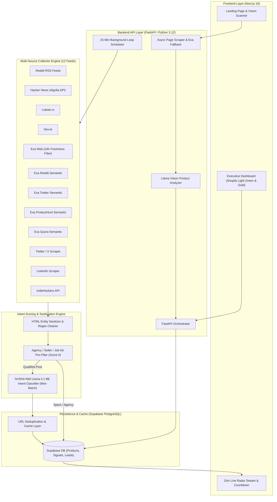
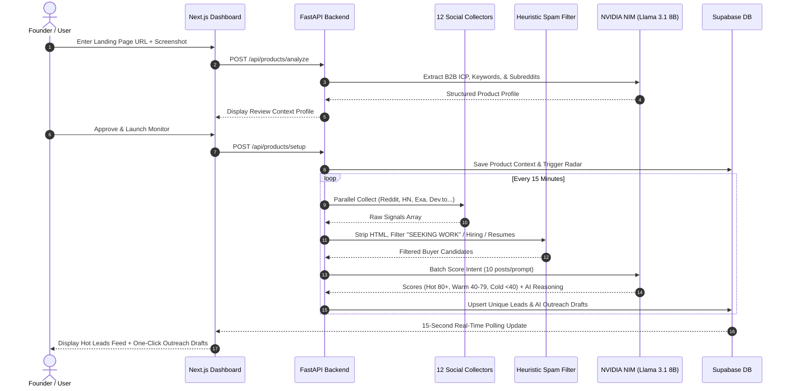

# Czero — Intent-Based Lead Generation SaaS

> **"Get your first 10 users by Sunday."**  
> Czero is an autonomous social listening and intent-scoring engine for B2B founders and indie hackers. It monitors 12 multichannel sources in real-time, filters out promoter spam and agency ads, and delivers verified buyer signals with pre-drafted AI outreach responses.

---

## 📐 System Architecture



---

## 🔄 Data Pipeline & Intent Scoring Flow



---

## ✨ Core Features

* **12 Multichannel Signal Feeds**: Runs parallel collection across Reddit (RSS & Exa), Hacker News, Lobste.rs, Dev.to, Exa Web (24-hour freshness filter), Exa Twitter, Exa ProductHunt, Exa Quora, LinkedIn, Twitter, and IndieHackers.
* **Heuristic Spam & Agency Pre-Filter**: Auto-drops agency ads (`"SEEKING WORK"`), job listings (`"Hiring"`), resume/CV posts (`"willing to relocate"`), and promoter showcases (`"I built X"`) to **Score 0 (COLD)** before LLM evaluation, saving API costs.
* **NVIDIA NIM LLM Intent Classifier**: Powered by `meta/llama-3.1-8b-instruct`. Evaluates true buying intent vs builder chatter, outputting structured scores (0-100%) and explicit AI reasoning.
* **Context Mini-Batching**: Chunks LLM prompts into max 10 posts per call to eliminate context hallucinations and cross-post category bleeding.
* **HTML Entity Sanitizer**: Strips raw HTML tags (`<p>`, `<a>`) and unescapes entities (`&#x2F;` $\rightarrow$ `/`, `&amp;` $\rightarrow$ `&`) on both client and server layers.
* **Persistent Live Radar Stream**: Synchronizes 15-minute background sweep target timestamps in `localStorage` (`czero_next_sweep_target`) to keep the countdown active across navigation.
* **Shopify-Inspired Light Mode Design System**: Crafted with Deep Forest Green (`#072720`), Metallic Champagne Gold (`#d4af37`), Mint Pulse (`#10b981`), and soft porcelain card surfaces (`#f4f7f5`).

---

## 🛠️ Tech Stack

* **Frontend**: Next.js 16 (App Router), TypeScript, Tailwind CSS, Turbopack.
* **Backend**: FastAPI (Python 3.12), Asyncio Event Loop, Uvicorn.
* **LLM Engine**: NVIDIA NIM API (`meta/llama-3.1-8b-instruct`).
* **Search & Collection**: Exa.ai API, Algolia Search API, Reddit RSS.
* **Database & Auth**: Supabase (PostgreSQL with Row Level Security).

---

## 📁 Repository Structure

```
Czero/
├── api/                                 # FastAPI Backend Service
│   ├── app/
│   │   ├── main.py                      # FastAPI Application Entrypoint
│   │   ├── config.py                    # Environment Configuration
│   │   ├── engines/
│   │   │   ├── collector/               # Signal Collection Engine (12 Sources)
│   │   │   │   ├── orchestrator.py      # Master Parallel Collector Engine
│   │   │   │   └── sources/             # Source-specific collectors
│   │   │   ├── scorer/
│   │   │   │   └── llm_scorer.py        # Pre-Filter Heuristics & NIM Scorer
│   │   │   └── enricher/                # Contact Enrichment
│   │   ├── routes/                      # API Endpoints (/products, /leads, /scan)
│   │   ├── services/
│   │   │   ├── analyzer.py              # Landing Page Vision & Text Analyzer
│   │   │   ├── db.py                    # Supabase Database Service
│   │   │   ├── keyword_generator.py     # Buyer-Intent Query Generator
│   │   │   └── scraper.py               # Async Web Scraper + Exa Fallback
│   │   └── workers/
│   │       └── scheduler.py             # 15-Minute Background Radar Loop
│   ├── requirements.txt
│   └── venv/
├── frontend/                            # Next.js 16 App Router UI
│   ├── src/
│   │   ├── app/
│   │   │   ├── globals.css              # Deep Green & Champagne Gold Theme
│   │   │   ├── page.tsx                 # Landing Page
│   │   │   └── dashboard/               # Main SaaS Dashboard
│   │   │       ├── layout.tsx           # Executive Sidebar Navigation
│   │   │       ├── page.tsx             # Workspaces Dashboard
│   │   │       ├── home/page.tsx        # URL Analysis Onboarding
│   │   │       ├── products/[productId]/# Live Product Radar Feed
│   │   │       ├── leads/[leadId]/      # Deep Lead Inspection & AI Outreach
│   │   │       ├── settings/page.tsx    # Radar Configuration & Review
│   │   │       └── profile/page.tsx     # Account Credentials & Subscription
│   ├── package.json
│   └── tailwind.config.js
├── supabase/
│   └── schema.sql                       # Database Schema & RLS Policies
├── PROJECT_CONTEXT_HANDOFF.md           # Deep Context Documentation
├── Shopify-DESIGN (1).md                # Visual Style Specification
└── README.md
```

---

## ⚡ Quick Start Guide

### 1. Prerequisites
* Python 3.12+ installed
* Node.js 18+ & npm installed
* Supabase account & project
* NVIDIA NIM API key or compatible LLM endpoint
* Exa.ai API key

### 2. Environment Setup

Create `.env` in `api/`:
```env
SUPABASE_URL=https://your-project.supabase.co
SUPABASE_ANON_KEY=your-anon-key
SUPABASE_SERVICE_ROLE_KEY=your-service-role-key
MIMO_API_KEY=your-nvidia-nim-or-mimo-api-key
EXA_API_KEY=your-exa-api-key
FRONTEND_URL=http://localhost:3000
```

Create `.env.local` in `frontend/`:
```env
NEXT_PUBLIC_SUPABASE_URL=https://your-project.supabase.co
NEXT_PUBLIC_SUPABASE_ANON_KEY=your-anon-key
```

### 3. Run Backend (FastAPI)
```bash
cd api
# Create virtual environment
python -m venv venv
# Activate on Windows PowerShell
.\venv\Scripts\Activate.ps1

# Install dependencies
pip install -r requirements.txt

# Run server with Uvicorn
$env:PYTHONPATH="." ; venv/Scripts/python.exe -m uvicorn app.main:app --reload --port 8000
```

### 4. Run Frontend (Next.js 16)
```bash
cd frontend
npm install
npm run dev
```

Open `http://localhost:3000` in your browser.

---

## 📡 API Endpoint Reference

| Method | Endpoint | Description |
|---|---|---|
| `POST` | `/api/products/analyze` | Scrapes URL & image to generate initial B2B ICP & subreddits. |
| `POST` | `/api/products/setup` | Saves workspace configuration and launches initial background scan. |
| `GET` | `/api/products?user_id=...` | Fetches active product workspaces for a user. |
| `GET` | `/api/leads?product_id=...` | Returns scored buyer leads and outreach drafts. |
| `POST` | `/api/products/scan` | Manually triggers an immediate 12-source radar sweep. |

---

## 📝 License

Distributed under the MIT License. See `LICENSE` for more information.
